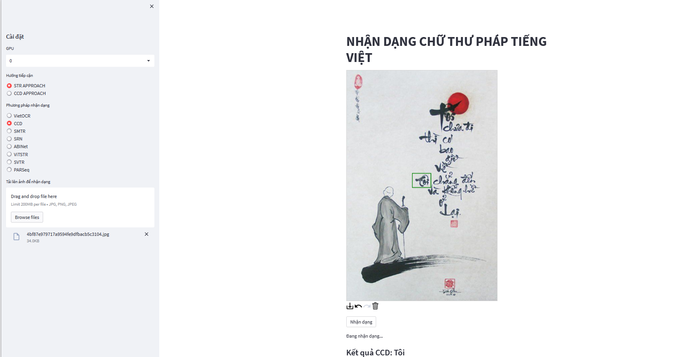

# Datasets
* [Vicalligraphy](/mlcv2/WorkingSpace/Personal/hamh/Ha/Data/Vicalligraphy/ViCalligraphy):  A dataset collected from the Internet, consisting of Vietnamese calligraphy images in various writing styles.
* [ViSynth1M](/mlcv2/WorkingSpace/Personal/hamh/Ha/Data/Vi_Synthtiger_1M): A synthetic dataset containing 1,000,000 scene text images. 
* [ViCalligraphySynth](/mlcv2/WorkingSpace/Personal/hamh/Ha/Data/ViCalligraphy-Augment/ViCalligrphy_3000_VNI_7000_Unicode):  A synthetic dataset containing 10,000 generated Vietnamese calligraphy images, created using 5  Vietnamese calligraphy fonts. It is designed to improve OCR models' ability to recognize calligraphic text with diverse font styles and layouts.
* [SupportSamples](/mlcv2/WorkingSpace/Personal/hamh/Ha/Data/SupportSamples): Used to compare confused words and select the most similar ones generated from 5 Vietnamese calligraphy fonts.

# ABINet, SRN, PARSeq, SVTR, ViTSTR  
Utilize [PaddleOCR](https://github.com/PaddlePaddle/PaddleOCR) to train and evaluate 5 models: ABINet, SRN, PARSeq, SVTR, ViTSTR
## Installation
Ensure you have Python **3.7** or later installed. Then, install **PaddleOCR** using:

```bash
pip install paddlepaddle-gpu==2.6.1
```

If having any error, please follow the official guide here: [PaddleOCR Quick Start](https://github.com/PaddlePaddle/PaddleOCR/blob/release/2.6.1/doc/doc_en/quickstart_en.md) 

## Training  
Run the following command to train a model:  

```bash
python tools/train.py -c path/to/config/file
```

Configuration files for models can be found in: [PaddleOCR/config/ViCalligraphy/](/mlcv2/WorkingSpace/Personal/hamh/Ha/Methods/PaddleOCR/configs/ViCalligraphy/) 

## Evaluation  
To evaluate a trained model, use:  

```bash
python tools/eval.py -c path/to/config/file -o Global.pretrained_model=path/to/pretrained/model
```

Checkpoints for models can be found in: [PaddleOCR/output/rec/](/mlcv2/WorkingSpace/Personal/hamh/Ha/Methods/PaddleOCR/output/rec/) 

# VietOCR
Train and evaluate VietOCR

## Installation
Install using pip: 
```bash
pip install vietocr
```

## Quick Start
You can follow this notebook: [vietocr/ViCalligraphy.ipynb](/mlcv2/WorkingSpace/Personal/hamh/Ha/Methods/vietocr/ViCalligraphy.ipynb) to know how to use the model.

Our model weight here: [vietocr/weights/transformerocr.pth](/mlcv2/WorkingSpace/Personal/hamh/Ha/Methods/vietocr/weights/transformerocr.pth)

# SMTR
Utilize [OpenOCR](https://github.com/Topdu/OpenOCR) to train and evaluate SMTR

## Quick Start
### Dependencies: 
* PyTorch version >= 1.13.0
* Python version >= 3.7

```bash
conda create -n openocr python==3.8
conda activate openocr
# install gpu version torch
conda install pytorch==2.2.0 torchvision==0.17.0 torchaudio==2.2.0 pytorch-cuda=11.8 -c pytorch -c nvidia
# or cpu version
conda install pytorch torchvision torchaudio cpuonly -c pytorch
```
After installing dependencies, the following two installation methods are available. Either one can be chosen.

**Usage**:

```bash
python tools/infer_rec.py --c ./configs/rec/svtrv2/repsvtr_ch.yml --o Global.infer_img=/path/img_fold or /path/img_file
```

Our config file: [OpenOCR/configs/smtr/config.yml](/mlcv2/WorkingSpace/Personal/hamh/Ha/Methods/OpenOCR/configs/smtr/config.yml)

Our checkpoint [here](/mlcv2/WorkingSpace/Personal/hamh/Ha/Methods/OpenOCR/output/rec/focalsvtr_smtr/best.pth).


# CCD

## Installation
Python == 3.7
```bash
conda install pytorch==1.10.0 torchvision==0.11.0 torchaudio==0.10.0 cudatoolkit=11.3 -c pytorch -c conda-forge
pip install -r CCD/CCD_Ha/requirement.txt
```

## Fine-tuning
The difference between character-based and stroke-based models lies only in the inference step. Therefore, during fine-tuning, we follow the training approach of the character-based model.
```bash
cd CCD/CCD_Ha/
CUDA_VISIBLE_DEVICES=0,1,2,3 python -m torch.distributed.launch --nproc_per_node=4 CCD_Ha/train_finetune.py --config path/to/config/file
```

Our configuration files: [CCD/CCD_Ha/Dino/configs/](/mlcv2/WorkingSpace/Personal/hamh/Ha/Methods/CCD/CCD_Ha/Dino/configs/)

### Character-based models:
- **ViCalligraphy**: [Config file](/mlcv2/WorkingSpace/Personal/hamh/Ha/Methods/CCD/CCD_Ha/Dino/configs/CCD_vision_model_ARD_base_ViCalligraphy.yaml)
- **ViCalligraphy + ViCalligraphySynth**: [Config file](/mlcv2/WorkingSpace/Personal/hamh/Ha/Methods/CCD/CCD_Ha/Dino/configs/CCD_vision_model_ARD_base_ViCalligraphy_3000-VNI_7000-Unicode.yaml)
- **ViSynth1m + ViCalligraphy**: [Config file](/mlcv2/WorkingSpace/Personal/hamh/Ha/Methods/CCD/CCD_Ha/Dino/configs/CCD_vision_model_ARD_base_1m+finetune_ViCalligraphy.yaml)
- **ViSynth1m + ViCalligraphy + ViCalligraphySynth**: [Config file](/mlcv2/WorkingSpace/Personal/hamh/Ha/Methods/CCD/CCD_Ha/Dino/configs/CCD_vision_model_ARD_base_1m+finetune_ViCalligraphy_3000-VNI_7000-Unicode.yaml)

### Stroke-based models:
- **ViCalligraphy**: [Config file](/mlcv2/WorkingSpace/Personal/hamh/Ha/Methods/CCD/CCD_Ha/Dino/configs/CCD_vision_model_ARD_base_ViCalligraphy_stroke.yaml)
- **ViCalligraphy + ViCalligraphySynth**: [Config file](/mlcv2/WorkingSpace/Personal/hamh/Ha/Methods/CCD/CCD_Ha/Dino/configs/CCD_vision_model_ARD_base_ViCalligraphy_10000_stroke.yaml)
- **ViSynth1m + ViCalligraphy**: [Config file](/mlcv2/WorkingSpace/Personal/hamh/Ha/Methods/CCD/CCD_Ha/Dino/configs/1m+ViCalligraphy_stroke/CCD_vision_model_1m_stroke_ViCalligraphy_stroke.yaml)
- **ViSynth1m + ViCalligraphy + ViCalligraphySynth**: [Config file](/mlcv2/WorkingSpace/Personal/hamh/Ha/Methods/CCD/CCD_Ha/Dino/configs/1m+ViCalligraphy_stroke/CCD_vision_model_1m_stroke_ViCalligraphy_10000_stroke.yaml)

## Testing
```bash
# Character-based
cd CCD/CCD_Ha
CUDA_VISIBLE_DEVICES=0 python test.py --config path/to/config/file

# Stroke-based (Stroke-level Decomposition)
cd CCD/CCD_stroke
CUDA_VISIBLE_DEVICES=0 python test.py --config path/to/config/file
```

Our checkpoint files: [CCD/CCD_Ha/saved_models/](/mlcv2/WorkingSpace/Personal/hamh/Ha/Methods/CCD/CCD_Ha/saved_models/)

### Character-based models:
- **ViCalligraphy**: [Checkpoint](/mlcv2/WorkingSpace/Personal/hamh/Ha/Methods/CCD/CCD_Ha/saved_models/CCD_finetune_100epochs_ViCalligraphy_base_case_sensitive/best_accuracy.pth)
- **ViCalligraphy + ViCalligraphySynth**: [Checkpoint](/mlcv2/WorkingSpace/Personal/hamh/Ha/Methods/CCD/CCD_Ha/saved_models/CCD_finetune_100epochs_ViCalligraphy_3000-VNI_7000-Unicode_base_case_sensitive/best_accuracy.pth)
- **ViSynth1m + ViCalligraphy**: [Checkpoint](/mlcv2/WorkingSpace/Personal/hamh/Ha/Methods/CCD/CCD_Ha/saved_models/CCD_finetune_1m_finetune_ViCalligraphy/best_accuracy.pth)
- **ViSynth1m + ViCalligraphy + ViCalligraphySynth**: [Checkpoint](/mlcv2/WorkingSpace/Personal/hamh/Ha/Methods/CCD/CCD_Ha/saved_models/CCD_finetune_1m_finetune_ViCalligraphy_3000-VNI_7000-Unicode/best_accuracy.pth)

### Stroke-based models:
- **ViCalligraphy**: [Checkpoint](/mlcv2/WorkingSpace/Personal/hamh/Ha/Methods/CCD/CCD_Ha/saved_models/CCD_finetune_vicalligraphy_stroke_len_40_v1/best_accuracy.pth)
- **ViCalligraphy + ViCalligraphySynth**: [Checkpoint](/mlcv2/WorkingSpace/Personal/hamh/Ha/Methods/CCD/CCD_Ha/saved_models/CCD_finetune_vicalligraphy_10000_stroke_len_40/best_accuracy.pth)
- **ViSynth1m + ViCalligraphy**: [Checkpoint](/mlcv2/WorkingSpace/Personal/hamh/Ha/Methods/CCD/CCD_Ha/saved_models/CCD_finetune_1m_stroke_vicalligraphy_stroke_len_40_v2/best_accuracy.pth)
- **ViSynth1m + ViCalligraphy + ViCalligraphySynth**: [Checkpoint](/mlcv2/WorkingSpace/Personal/hamh/Ha/Methods/CCD/CCD_Ha/saved_models/CCD_finetune_1m_stroke_vicalligraphy_10000_stroke_len_40/best_accuracy.pth)


# Demo App
## Installation
Python = 3.7
```bash
pip install streamlit==1.23.1 streamlit-drawable-canvas
```

## Run app
```bash
streamlit run DemoSTR/app.py --server.port 8501 --server.address 0.0.0.0
```



